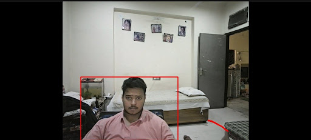
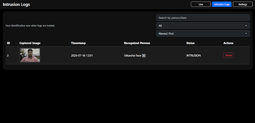
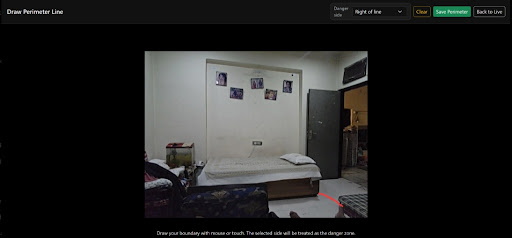
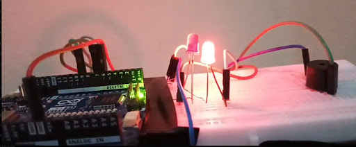
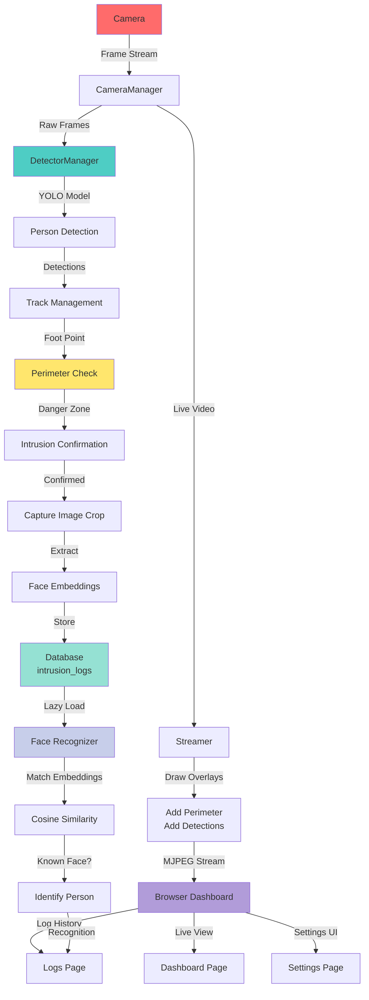

# Intrusion Detector

[](https://www.python.org/downloads/)
[](https://fastapi.tiangolo.com/)
[](https://opencv.org/)
[](https://ultralytics.com/)
[](LICENSE)
[](https://www.uvicorn.org/)

Real-time surveillance system with AI-powered intrusion detection, custom perimeter monitoring, and face recognition.

---

## Features

- Real-Time Person Detection – YOLO11 detects people in live camera feed with 0.1s analysis interval
- Custom Perimeter Drawing – Draw danger zones directly on the live video stream with configurable left/right danger side
- Intrusion Confirmation – Intelligent 1-second confirmation window prevents false positives
- Automatic Capture – Captures high-quality images of detected intruders automatically
- Face Recognition – Identifies known individuals using InsightFace embeddings with cosine similarity matching
- Live MJPEG Streaming – Real-time video feed rendered in browser with detection overlays and perimeter visualization
- Intrusion Logging – SQLite database stores complete intrusion history with timestamps, images, and recognition results
- Interactive Dashboard – Browser-based UI for live monitoring, settings, and intrusion log review
- Advanced Log Filtering – Search by person name, filter by known/unknown/multiple identifications, sort by date
- Lazy Face Recognition – Identifies people on-demand when viewing logs (keeps streaming smooth)
- Configurable Thresholds – Adjustable confidence levels, face similarity threshold (55% default), and analysis intervals
- Known Face Library – Load known face embeddings from disk to enable identification
- Clean Shutdown – Daemon threads ensure graceful application termination with Ctrl+C

---

## Demo


### Screenshots
#### Intrusion Detection


#### Logs & Recognition


#### Perimeter Settings


#### Hardware Demo


---

## Project Architecture



---

## Installation

### Prerequisites
- Python 3.9 or higher
- Webcam connected to your machine
- Windows, macOS, or Linux

### Setup
1. Clone repository:
   ```bash
   git clone https://github.com/yourusername/CVboundary.git
   cd CVboundary
   ```

2. Create virtual environment:
   ```bash
   # Windows
   python -m venv .venv-1
   .\.venv-1\Scripts\activate

   # macOS/Linux
   python3 -m venv .venv-1
   source .venv-1/bin/activate
   ```

3. Install dependencies:
   ```bash
   pip install -r requirements.txt
   ```

4. Download YOLO model (auto-downloads on first run):
   ```bash
   python -c "from ultralytics import YOLO; YOLO('yolo11x.pt')"
   ```

5. Run application:
   ```bash
   uvicorn app:app --host 0.0.0.0 --port 8000 --reload
   ```

6. Access dashboard at `http://localhost:8000`

---

## Configuration

All settings defined in `config.py`:
- Model & Detection: `YOLO_MODEL_PATH`, `CONFIDENCE_THRESHOLD`, `ANALYSIS_INTERVAL_SECONDS`
- Perimeter & Thresholds: `BOUNDARY_PERCENTAGE`, `FACE_SIMILARITY_THRESHOLD`
- Directories: `DATABASE_PATH`, `KNOWN_FACES_DIR`, `EMBEDDINGS_DIR`, `CAPTURED_IMAGES_DIR`, `INTRUSION_EMBEDDINGS_DIR`, `PERIMETER_FILE`

### Key Configuration Options
| Setting | Default | Description |
|---------|---------|-------------|
| `CONFIDENCE_THRESHOLD` | 0.5 | Lower = more detections but more false positives |
| `ANALYSIS_INTERVAL_SECONDS` | 0.1 | Lower = more frequent analysis (more CPU) |
| `BOUNDARY_PERCENTAGE` | 0.25 | Initial perimeter position (25% from left) |
| `FACE_SIMILARITY_THRESHOLD` | 0.55 | Higher = stricter face matching |

### Environment Variables
Set optional webhook for alarm notifications:
```bash
export ALARM_WEBHOOK_URL=https://your-webhook-endpoint.com/webhook
```

---

## Technologies Used

| Technology | Purpose |
|------------|---------|
| FastAPI | Web framework for REST API & routing |
| Uvicorn | ASGI server for running FastAPI |
| OpenCV | Webcam access, image processing, encoding |
| Ultralytics YOLO | Real-time person detection model |
| InsightFace | Face embedding extraction & analysis |
| SQLAlchemy | Object-relational mapping for database |
| Jinja2 | HTML template rendering |
| NumPy | Numerical operations & embedding storage |
| SQLite | Lightweight embedded database |
| Bootstrap 5 | Frontend CSS framework |

---

## API Endpoints

### Web Pages (HTML)
```
GET  /                      # Live dashboard
GET  /settings              # Perimeter drawing
GET  /logs                  # Intrusion history
```

### Video Streaming
```
GET  /video_feed            # MJPEG stream (multipart/x-mixed-replace)
GET  /api/settings/frame    # Single frame for settings canvas
```

### Perimeter API
```
GET    /api/perimeter       # Get current perimeter & danger_side
POST   /api/perimeter       # Save new perimeter
DELETE /api/perimeter       # Clear perimeter
```

### Intrusion Logs API
```
GET    /captures/{image_name}   # Fetch captured image by filename
```

---

## How It Works

### Intrusion Detection
1. YOLO11 detects people every 0.1s
2. Estimates foot point (center-bottom of bounding box)
3. Checks if foot point is in danger zone
4. Requires person to stay in zone for ≥1 second to confirm
5. Captures image and extracts face embeddings

### Face Recognition
- Uses InsightFace buffalo_l model
- Compares embeddings using cosine similarity
- Threshold: 55% (configurable)
- Lazy loading: runs only when logs page is viewed

### Database Schema
- Table: `intrusion_logs`
- Fields: id, timestamp, image_path, embeddings_path, recognized_people, status, created_at

---

## Folder Structure

```
CVboundary/
├── app.py                    # FastAPI main application & routes
├── camera.py                 # Webcam capture (daemon thread)
├── detector.py               # YOLO detection + perimeter logic
├── streamer.py               # MJPEG streaming generator
├── perimeter.py              # Danger zone boundary management
├── face_recognition.py       # Face embedding extraction & matching
├── database.py               # SQLAlchemy setup & initialization
├── models.py                 # IntrusionLog database model
├── crud.py                   # Create/Read/Update/Delete operations
├── config.py                 # Configuration constants
├── cosine.py                 # Cosine similarity calculation
├── templates/                # HTML templates
│   ├── index.html            # Live dashboard
│   ├── settings.html         # Perimeter drawing
│   └── logs.html             # Intrusion history
├── static/                   # Frontend assets
│   ├── css/style.css
│   └── js/
│       ├── settings.js
│       └── logs.js
├── database/                 # SQLite database & perimeter config
├── captured_intrusions/      # JPEG images of detected intruders
├── intrusion_embeddings/     # NumPy files with face embeddings
├── known_faces/              # Reference images for identification
├── numpy-saves/              # Pre-computed known face embeddings
└── MODELS/                   # YOLO11 model weights
```

---

## Deployment Options

### Local Development
```bash
uvicorn app:app --reload
```

### Production (Systemd)
Create `/etc/systemd/system/cvboundary.service`:
```ini
[Unit]
Description=CVboundary Surveillance System
After=network.target

[Service]
Type=simple
User=cvboundary
WorkingDirectory=/opt/cvboundary
ExecStart=/opt/cvboundary/.venv-1/bin/uvicorn app:app --host 0.0.0.0 --port 8000
Restart=always
RestartSec=10

[Install]
WantedBy=multi-user.target
```

Enable and start:
```bash
sudo systemctl enable cvboundary
sudo systemctl start cvboundary
```

---

## Troubleshooting

### Camera Not Detected
```bash
python -c "import cv2; cap = cv2.VideoCapture(0); print(cap.isOpened())"
```

### High CPU Usage
- Increase `ANALYSIS_INTERVAL_SECONDS` in config.py
- Lower `CONFIDENCE_THRESHOLD` to reduce YOLO computations
- Use GPU acceleration if available

### Face Recognition Not Working
- Ensure `known_faces/` or `numpy-saves/` directories exist
- Check folder structure: `known_faces/PersonName/*.jpg`
- Lower `FACE_SIMILARITY_THRESHOLD` for more lenient matching

---

## License

This project is licensed under the MIT License. See [LICENSE](LICENSE) file for details.

---

## Additional Resources

- [FastAPI Documentation](https://fastapi.tiangolo.com/)
- [Ultralytics YOLOv11](https://docs.ultralytics.com/)
- [InsightFace GitHub](https://github.com/deepinsight/insightface)
- [OpenCV Documentation](https://docs.opencv.org/)
- [SQLAlchemy ORM](https://docs.sqlalchemy.org/)

---

<div align="center">
Made by Team PAPER
</div>
